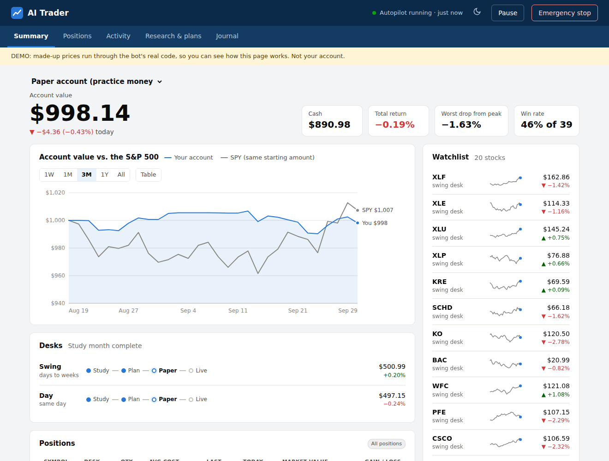

# Aistock

## ⬇️ [Download Kestrel for Mac](https://github.com/pbelfand-dot/Aistock/releases/latest/download/Kestrel-mac.zip)

**Kestrel** (formerly "AI Trader") is an AI trading bot for **Alpaca** (now) and **Charles Schwab**
(later). It studies the market for a month, writes a plan, proves it with paper money, and only
then trades real money, capped at $1,000. GitHub builds and tests it automatically every time the
code changes.

### Install (about 3 minutes)
1. Click the download link above and open **Kestrel-mac.zip** (it unzips itself).
2. Drag **Kestrel** into your **Applications** folder. It must live there to update itself.
3. Open it. The first time, macOS blocks apps that aren't from the App Store:
   - Click **Done**, then open **System Settings → Privacy & Security**, scroll down, and click
     **Open Anyway** next to "Kestrel" (you may need your Mac password).
   - Or paste this in Terminal instead:
     `xattr -dr com.apple.quarantine "/Applications/Kestrel.app"`
4. **The first time only**, a Terminal window installs Python and the bot's libraries (about
   2 minutes). Then the dashboard appears with the **Setup** screen on top.
5. In **Setup**: paste your Alpaca paper keys → **Save and test** → **Autopilot: Turn on** →
   **Start Stage 1 paper trading** (pretend money; it decides 15 minutes before each close).

### The app
**Kestrel** is a normal Mac app: its own window, Dock icon and menus (no browser, no web server).
- **Its window** is a brokerage-style dashboard: your account value vs. the S&P 500, positions,
  every trade and why, each desk's progress, the watchlist, and **Pause** / **Emergency stop**
  buttons.
- **Trades** (a tab) shows every trade: what it spent, what it got back, the gain or loss in $ and %,
  win or lose, each day's % change, and the totals vs. the S&P 500. It works the same for all three
  accounts (pick one at the top of the Summary tab): *In its head* (pretend trades while a desk
  studies), *Paper* and *Real money*.
- **View → Show Demo Data** shows it with made-up prices right away.
- **Setup** (the button) connects Alpaca, switches the autopilot and says what's next.
- **Kestrel → Setup Menu** (⌘,) opens the full Terminal menu (plans, real money, Schwab).

It's the bot's own design, not Schwab's or Alpaca's: it never shows or asks for your broker
login, and it can't buy anything. Closing the app doesn't stop the background autopilot.

Everything lives in the **AITrader** folder in your home folder (your keys, settings, and the
bot's memory).

**Updates are automatic.** While the app is open, it checks once a day and when it opens. Paper
only: it updates by itself. Real money involved: it asks first. Your keys and data stay.

### Connect Claude
Menu → **Connect Claude Code** (or **Connect Claude Desktop**). Claude can then see the bot
(status, trades, plans) and pause it, and read your Schwab account once you add Schwab. It can't trade.

### What's in this repo
- [`trader/`](trader/): the bot. [Full guide →](trader/README.md)
- [`mac/`](mac/): the Mac app (a Swift window, `mac/app/main.swift`) and how it is built
- `backend/`, `frontend/`: the earlier stock-suggestion web app

> Not financial advice. Most people who trade actively lose money. The bot's first job is to
> find out safely whether a strategy has an edge, and to say "don't trade" if it doesn't.
