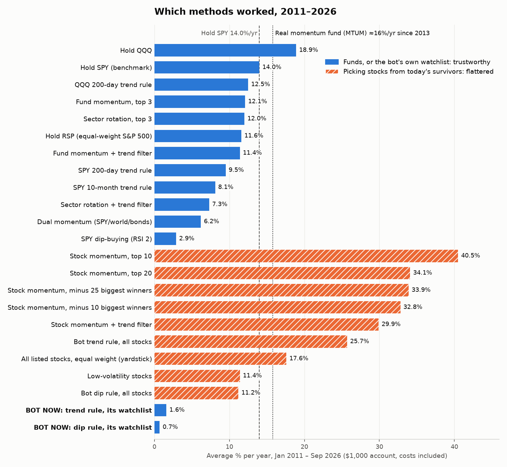

# Which trading methods worked, 2011–2026: a fair side-by-side test

Run: `python research/history/methods.py OUT_DIR <bundles>`. The chart comes from `chart_methods.py`.
Full numbers: [`methods_summary.csv`](methods_summary.csv).

Every method ran under the same rules:
- a $1,000 account with fractional shares, buying only (no shorting);
- decided on one day's close and traded at the next day's open;
- a 0.05% cost on every dollar traded;
- Jan 3, 2011 to Sep 29, 2026.

Each method used its published standard settings, with no tuning.

## Two kinds of results

- **Funds (blue): trustworthy.** SPY, QQQ, the sector funds, the world funds and the bond funds
  all existed for the whole period.
- **Stock picking (orange): flattered.** The data only has companies that are still around and
  popular in 2026 (survivorship bias). The yardstick below shows how much that flatters.
  - **Yardstick:** buying every stock in the list equally made **17.6% a year**.
  - The real equal-weight S&P 500 fund (RSP) made **11.6%**.
  - So the list itself adds about **6 points a year of return nobody could have had.**
  - Momentum is hurt most by this bias: it buys stocks that went up a lot, and in a survivors-only
    list those are, by construction, the ones that kept going.
- **Reality check for momentum:** a real momentum fund (iShares MTUM, since April 2013) made about
  **15.6–16% a year**. SPY made 14.4% over the same span in this data. So in real life momentum was
  **the market plus a point or two**, not 40%.
- **Data check:** there were 6 one-day moves over +60% or under −50%. Five are real events (PG&E
  bankruptcy, OXY's 2020 crash, BLDR's merger, MRNA's Aug 2026 jump). One is a data error: DHR's
  2016 spin-off adjustment. Its effect on these results is negligible.

## Results

| Method | $1,000 became | Per year | Worst drop | 2011–17 / 2018–26 per year | Years beat SPY (of 16) |
|---|---|---|---|---|---|
| **Hold SPY (benchmark)** | $7,906 | 14.0% | −33.7% | 13.5% / 14.4% | – |
| Hold QQQ | $15,207 | 18.9% | −35.1% | 17.2% / 20.0% | 13 |
| QQQ 200-day trend rule | $6,363 | 12.5% | −27.0% | 8.7% / 15.4% | 8 |
| Fund momentum, top 3 | $5,994 | 12.1% | −43.1% | 2.0% / 20.5% | 5 |
| Sector rotation, top 3 | $5,916 | 12.0% | −29.7% | 11.7% / 12.1% | 6 |
| Hold RSP (equal-weight S&P 500) | $5,662 | 11.6% | −39.0% | 13.0% / 10.5% | 6 |
| SPY 200-day trend rule | $4,180 | 9.5% | **−21.7%** | 9.4% / 9.5% | 6 |
| SPY 10-month trend rule | $3,419 | 8.1% | −27.7% | 9.7% / 6.8% | 5 |
| Dual momentum (SPY / world / bonds) | $2,571 | 6.2% | −39.1% | 7.5% / 5.1% | 4 |
| SPY dip-buying (RSI 2) | $1,566 | 2.9% | −15.0% | 2.6% / 3.2% | 2 |
| *All listed stocks, equal weight (yardstick)* | *$12,818* | *17.6%* | *−38.6%* | *19.4% / 16.0%* | *13* |
| *Stock momentum, top 10* | *$210,666* | *40.5%* | *−44.2%* | *32.4% / 46.8%* | *15* |
| *Stock momentum, top 10, minus the 25 biggest winners* | *$99,132* | *33.9%* | *−40.6%* | *23.7% / 42.4%* | *13* |
| *Stock momentum, top 10 + trend filter* | *$61,690* | *29.9%* | *−33.4%* | *35.1% / 25.5%* | *10* |
| *Bot trend rule, all stocks* | *$36,760* | *25.7%* | *−33.2%* | *25.5% / 25.7%* | *12* |
| *Low-volatility stocks, 20* | *$5,439* | *11.4%* | *−33.1%* | *14.7% / 8.9%* | *5* |
| **Bot's current trend rule, its watchlist** | $1,274 | **1.6%** | −15.5% | 2.6% / 0.7% | 2 |
| **Bot's current dip rule, its watchlist** | $1,119 | **0.7%** | −11.9% | 1.9% / −0.2% | 3 |

*Italic = picked from today's survivors (flattered).* The table leaves out the sector and fund
versions with a trend filter and "momentum top 20"; they are in the CSV. The 10 biggest winners
over the period (only knowable in hindsight) were NVDA ×628, TSLA ×199, AVGO ×182, MU ×132,
STX ×118, MPWR ×94, KLAC ×88, SHOP ×87, AMD ×72 and FTNT ×53.

## Can 30 trading days prove anything?

The test checked every 30-trading-day window from 2011 to 2026 (the length of Stage 1). In what
share of them did a method both **make money and beat SPY by more than 0.5 points**?

| Method | Made money and beat SPY in a 30-day window |
|---|---|
| Stock momentum, top 10 (flattered) | 58% |
| Stock momentum + trend filter (flattered) | 49% |
| Hold QQQ | 47% |
| Bot's current trend rule, its watchlist | 8% |

**Even the best method fails a "make money and beat SPY in 30 days" test about 4 times in 10.**
One 30-day stage can catch a broken method, like the bot's current rules. It can't prove a good
one.

## What this says

1. **The bot's current swing setup doesn't work.** Its watchlist of calm, cheap names (XLF, XLE,
   XLU, XLP, SCHD, KO, BAC, PFE, CSCO, VZ) made 1–2% a year, about what short-term Treasuries (SHY) paid (1.3%). Stage 1
   must not run it as is.
2. **Among funds, nothing simple beat holding SPY, except holding QQQ.** QQQ's win is partly
   hindsight: it was tech's decade.
3. **Trend rules (the 200-day average) are insurance, not profit.** They cut the worst drop
   (SPY −34% → −22%) but gave up 4–5 points a year. They are useful for sleeping at night and for
   protecting a small live account.
4. **Momentum is the one stock method with real-world support.** It is backed by MTUM, 30+ years
   of research and this test. The honest expectation is the market plus a little, with bigger
   drops, not the 40% shown here.
5. **Dip-buying SPY (RSI 2) barely beat cash** (2.9% vs 1.3% a year for SHY): it sits in cash
   most of the time. Dual momentum and the monthly 10-month rule also lagged in this period.

## Limits
- Survivorship: stock-picking numbers are too high. Fixing that properly needs historical index
  membership data (who was in the index on each date), which the bundle doesn't have.
- No taxes. Monthly rebalancing makes almost all gains short-term (taxed as ordinary income).
- Fractional shares are assumed. Schwab's API can't place fractional orders.
