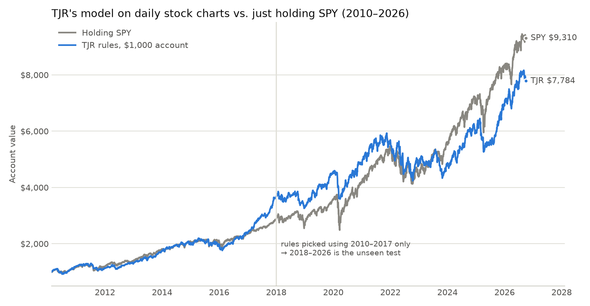

# TJR's model on 16 years of daily stock data: results

Run: `python research/history/tjr_daily.py OUT_DIR <bundles>` on the market research bundle
(399 symbols with enough history, daily, Jan 2010 to Sep 29, 2026). Rules: `research/tjr/RULES.md`
(draft 1) on daily bars. Costs 0.10% per round trip; a day that touches both stop and target counts
as a loss; no peeking (swing points only count once confirmed).

## Per trade (R = profit in units of the amount risked)

| Version | Trades | Win % | Avg R | Profit factor | Avg R 2010–17 | Avg R 2018–26 | **Placebo avg R** |
|---|---|---|---|---|---|---|---|
| Long, swing size 3, target = next high | 4,933 | 39.2 | +0.19 | 1.29 | +0.25 | +0.15 | +0.17 |
| Long, swing size 3, target = 2R | 10,440 | 44.8 | +0.21 | 1.37 | +0.27 | +0.16 | +0.18 |
| Long, swing size 5, target = next high | 2,608 | 41.1 | +0.24 | 1.39 | +0.33 | +0.18 | +0.19 |
| **Long, swing size 5, target = 2R** | 5,971 | 47.0 | **+0.24** | 1.45 | +0.33 | +0.17 | **+0.18** |
| Short (all four versions) | 5–11k each | 25–28 | −0.24 to −0.26 | 0.66–0.68 | | | |

**Placebo** = buying on random days in the same stocks with the same stop size and the same
reward-to-risk, same exits and costs.

## A $1,000 account (1% risk per trade, at most 2 new trades a day, fractional shares)
Version chosen using 2010–2017 only (swing size 5, target 2R); 2018–2026 is the unseen test.

| | Final value | Per year | Worst drop | Sharpe |
|---|---|---|---|---|
| TJR rules, all years | $7,784 | 13.1% | −28.5% | 0.93 |
| Holding SPY, all years | $9,310 | 14.4% | −33.7% | 0.87 |
| TJR rules, 2018–2026 (unseen) | | 9.0% | | 0.64 |
| Holding SPY, 2018–2026 | | 14.4% | | 0.81 |

Beat SPY in 7 of 17 calendar years (best: 2017 +54% vs +22%; worst: 2023 +0.5% vs +26%).
Trades ended: 49% at the stop, 31% at the target, 20% after 60 days; held ~27 days on average;
median stop ~5.6% below entry.

## What this says
1. **Buying works, the setup adds a little.** Every long version made money, but random buys with
   the same stop and target made almost as much (+0.18R vs +0.24R per trade). Most of the profit
   is stocks going up over 2010–2026 (and these are stocks that survived to 2026, which flatters
   any buying rule). The setup's extra edge is small (about +0.04 to +0.06R per trade) and was
   smaller in 2018–2026 than before.
2. **Shorting with it loses clearly** in every version. (The bot doesn't short anyway.)
3. **As an account it didn't beat holding SPY**: close over 16 years, but clearly behind in the
   unseen 2018–2026 test (9% vs 14% a year), with a somewhat smaller worst drop.

## Limits of this test
- **Daily charts aren't how TJR trades.** He sweeps and enters on 15-, 5- and 1-minute charts,
  mostly on indices, gold and forex. This tests the *idea* on daily stock charts; the real test of
  his method is intraday (needs Alpaca's minute data).
- Draft-1 defaults for the open questions (what counts as "prominent", entry depth, time windows).
- Today's stock list (survivorship); no taxes; fractional shares assumed.

## Next
- Intraday test: sweep of the previous day's / pre-market high-low → break of structure on
  5-minute → entry in the 1-minute gap, on SPY/QQQ and liquid stocks, with Alpaca minute data.
- Use the setup as a *filter* inside Stage 1 rather than a stand-alone strategy (Stage 2's plan).
